# bar_shop1 데이터베이스 ERD

## 핵심 관계도

```mermaid
erDiagram
    COMPANY {
        int COMPANY_SEQ PK
        varchar SALES_GUBUN
        varchar COMPANY_NAME
        datetime REGIST_DATE
    }

    S2_UserInfo {
        varchar uid PK
        varchar uname
        varchar umail
        varchar birth
        varchar address
    }

    S2_Card {
        int Card_Seq PK
        char CardBrand "B/S/C/X/W 등 18종"
        varchar Card_Code "BC5755 DDC_BC5995 등"
        char Card_Div "A01=청첩장 A02=봉투 등"
        varchar Card_Name
        int CardSet_Price "세트가격"
        int Card_Price "단가"
        char DISPLAY_YORN "Y/N"
        int Unit_Min "최소주문수량"
        int Unit_Max "최대주문수량"
    }

    S2_CardKind {
        int Card_Seq FK
        int CardKind_Seq FK "M:N 연결"
    }

    S2_CardKindInfo {
        int CardKind_Seq PK
        varchar CardKind "16종류명"
    }

    custom_order {
        int order_seq PK
        varchar order_type
        varchar sales_Gubun
        char site_gubun
        char pay_Type
        int company_seq FK
        int status_seq
    }

    custom_order_item {
        int id PK
        int order_seq FK
        int card_seq FK
        int item_count
        int item_price
        float item_sale_price
        float discount_rate
    }

    custom_order_qr {
        int qr_id PK
        int order_seq FK
        varchar qr_code
    }

    CUSTOM_SAMPLE_ORDER {
        int sample_order_seq PK
        int COMPANY_SEQ FK
        varchar MEMBER_ID
    }

    CUSTOM_SAMPLE_ORDER_ITEM {
        int SAMPLE_ORDER_ITEM_SEQ PK
        int SAMPLE_ORDER_SEQ FK
        int CARD_SEQ
    }

    COUPON_MST {
        int COUPON_MST_SEQ PK
        varchar COUPON_NAME
        datetime START_DATE
        datetime END_DATE
        char USE_YN
    }

    COUPON_DETAIL {
        int COUPON_DETAIL_SEQ PK
        int COUPON_MST_SEQ FK
        varchar COUPON_CODE
    }

    COUPON_ISSUE {
        int COUPON_ISSUE_SEQ PK
        int COUPON_DETAIL_SEQ FK
        varchar USER_ID
        char USE_YN
    }

    DELIVERY_INFO {
        int ORDER_SEQ
        int DELIVERY_SEQ
        varchar NAME
        varchar ADDR
    }

    ADMIN_LST {
        varchar ADMIN_ID PK
        int COMPANY_SEQ FK
        varchar ADMIN_NAME
    }

    custom_order ||--o{ custom_order_item : "has"
    custom_order ||--o{ custom_order_qr : "has"
    custom_order_item }o--|| S2_Card : "contains"
    S2_Card ||--o{ S2_CardKind : "classified as"
    S2_CardKind }o--|| S2_CardKindInfo : "type"
    CUSTOM_SAMPLE_ORDER ||--o{ CUSTOM_SAMPLE_ORDER_ITEM : "contains"
    CUSTOM_SAMPLE_ORDER }o--|| COMPANY : "belongs to"
    COUPON_MST ||--o{ COUPON_DETAIL : "has"
    COUPON_DETAIL ||--o{ COUPON_ISSUE : "issued"
    ADMIN_LST }o--|| COMPANY : "manages"
    custom_order ||--o{ DELIVERY_INFO : "ships"
```



## 핵심 관계 요약

### 주문 플로우
```
custom_order → custom_order_item → S2_Card (카드 상품)
                                 → DELIVERY_INFO (배송)
```

### 상품 분류
```
S2_Card → S2_CardKind (M:N) → S2_CardKindInfo (16종 카드 유형)
```

### 샘플 주문
```
CUSTOM_SAMPLE_ORDER → CUSTOM_SAMPLE_ORDER_ITEM → S2_Card
                    → COMPANY (거래처)
```

### 쿠폰
```
COUPON_MST → COUPON_DETAIL → COUPON_ISSUE (사용자별 발급)
```

## 비즈니스 규칙

1. S2_Card는 M:N 관계로 여러 종류(CardKind)에 속할 수 있음
2. Company_Seq는 S2_Card에 직접 존재하지 않음 (FK 없음)
3. 표시 여부는 DISPLAY_YORN (Y/N)으로 관리 (isDisplay 아님)
4. 유효 주문: `custom_order.status_seq >= 1`
5. 모바일 카드(mcard_) 테이블은 2021년 이후 비활성
