# DD (wedding) 데이터베이스 ERD

## 핵심 관계도

```mermaid
erDiagram
    users {
        int id PK
        varchar user_id "UNIQUE 로그인ID"
        varchar name
        varchar email "UNIQUE"
        varchar phone
        varchar join_channel
        varchar event_date "예식일"
        varchar hall "예식장명"
        int partner_shop_id
        timestamp created_at
    }

    products {
        int id PK
        varchar code "상품코드"
        varchar product_label
        varchar name
        varchar type "상품유형"
        decimal price "정가"
        decimal sale_price "판매가"
        char is_display "T/F"
        varchar printing_company "barunson"
        timestamp created_at
    }

    orders {
        int id PK
        varchar order_no "주문번호"
        varchar order_base "wcard"
        int user_id FK
        int partner_shop_id
        int total_money
        int paid_money
        varchar pay_type
        varchar order_state "B=대기"
        varchar shipping_state "B=대기"
        varchar printing_state "B=대기"
        varchar draft_state "B=대기"
        varchar shipping_number
        int barunson_order_seq
        timestamp created_at
    }

    order_items {
        int id PK
        varchar order_no FK
        varchar order_item_no
        int order_id FK
        int product_id FK
        varchar product_code
        int parent_id
        int qty
        int total_money
        int barunson_order_seq
        int barunson_card_seq
    }

    order_card_contents {
        int id PK
        int order_id FK
        int order_item_id FK
        varchar groom_name
        varchar bride_name
        varchar event_date
        varchar wedd_name
        varchar wedd_place
        int wedd_map_id FK
    }

    order_card_envelopes {
        int id PK
        int order_id FK
        int order_item_id FK
        varchar env_person1 "수신인1"
        varchar env_person2 "수신인2"
        varchar env_addr "주소"
    }

    order_item_addition {
        int id PK
        int order_id FK
        int order_item_id FK
        int addition_id FK
        int addition_item_id FK
        int item_cnt
        int add_price
    }

    order_item_options {
        int id PK
        int order_item_id FK
        int option_id FK
        int option_item_id FK
        int option_add_price
    }

    order_card_qty {
        int id PK
        int order_id FK
        int order_item_id FK
    }

    order_deposits {
        int id PK
        int order_id FK
        varchar order_no FK
        int deposit_money
        varchar deposit_progress "B=대기"
    }

    order_refunds {
        int id PK
        int order_id FK
        varchar order_no FK
        int refund_money
        char refund_type
    }

    order_coupon_history {
        int id PK
        int order_id FK
        int coupon_id FK
        int discount_price
    }

    addresses {
        int id PK
        int user_id FK
        varchar order_name
        varchar delivery_name
        varchar delivery_addr1
    }

    sample_orders {
        int id PK
        varchar sample_order_no
        int user_id FK
        varchar order_state
        varchar shipping_state
        int barunson_order_seq
    }

    sample_order_items {
        int id PK
        int sample_order_id FK
        int product_id FK
        varchar product_code
        int item_cnt
    }

    mobile_cards {
        int id PK
        int template_id FK
        int product_id FK
        int user_id FK
        int order_id FK
        varchar mcard_code "고유코드"
        varchar groom_name
        varchar bride_name
        varchar wedd_date
        varchar map_title
        char use_toss "축의금"
        char use_guestbook "방명록"
    }

    mobile_card_account {
        int target_id PK
        int sort PK
        int category PK
        varchar bank_code
        varchar account_number
        varchar account_holder
    }

    mobile_card_addition {
        int id PK
        int target_id FK
        varchar add_name
        varchar add_value
        varchar add_type
    }

    mobile_card_templates {
        int id PK
        varchar name
        varchar code
    }

    mobile_invitation_board {
        int id PK
        varchar board_key FK
        varchar name
        text contents
    }

    categories {
        int id PK
        int parent_id
        varchar cate_name
        int depth
    }

    category_product {
        int category_id FK
        int product_id FK
    }

    options {
        int id PK
        varchar name
        varchar code
        varchar option_type
    }

    options_items {
        int id PK
        int option_id FK
        varchar item_name
        float option_add_price
    }

    option_product {
        int option_id FK
        int product_id FK
    }

    invitation_card_addition {
        int id PK
        varchar add_code
        varchar add_name
        varchar add_type "TIC=식권"
        int add_price
    }

    invitation_card_addition_item {
        int id PK
        int addition_id FK
        varchar item_name
        int item_add_price
    }

    coupons {
        int id PK
        varchar coupon_name
        char coupon_type
        char benefit_type
        int benefit_price
    }

    coupon_issue {
        int id PK
        int coupon_id FK
        int user_id FK
        char is_used "T/F"
        varchar order_no
    }

    partner_shop {
        int id PK
        varchar partner_name
        int commission_rate
    }

    partner_users {
        int id PK
        int partner_shop_id FK
        varchar user_id
        varchar email "UNIQUE"
    }

    wedd_map {
        int id PK
        varchar wedd_name
        varchar wedd_addr1
    }

    wedd_map_item {
        int id PK
        int wedd_map_id FK
    }

    code_map_barunson {
        int id PK
        varchar item_code
        int barunson_card_seq
        varchar barunson_card_code
    }

    cj_invoice_numbers {
        int id PK
        varchar invoice_no "UNIQUE"
        char is_used "T/F"
        int order_id
    }

    lguplus_paid_list {
        int id PK
        varchar LGD_OID
        varchar LGD_TID
    }

    %% 관계 정의
    users ||--o{ orders : "주문"
    users ||--o{ sample_orders : "샘플주문"
    users ||--o{ addresses : "주소"
    users ||--o{ mobile_cards : "모바일청첩장"
    users ||--o{ coupon_issue : "쿠폰발급"
    users ||--o{ login_attempts : "로그인시도"
    users ||--o{ marketing_agreement : "마케팅동의"

    orders ||--o{ order_items : "주문항목"
    orders ||--o{ order_card_contents : "카드내용"
    orders ||--o{ order_card_envelopes : "봉투"
    orders ||--o{ order_card_qty : "수량"
    orders ||--o{ order_deposits : "입금"
    orders ||--o{ order_refunds : "환불"
    orders ||--o{ order_coupon_history : "쿠폰사용"
    orders ||--o{ order_item_addition : "부가항목"

    order_items ||--o{ order_item_options : "옵션"
    order_items ||--o{ order_item_addition : "부가항목"
    order_items }o--|| products : "상품"

    mobile_cards ||--o{ mobile_card_account : "계좌"
    mobile_cards ||--o{ mobile_card_addition : "추가요소"
    mobile_cards ||--o{ mobile_invitation_board : "방명록"
    mobile_cards }o--|| mobile_card_templates : "템플릿"

    sample_orders ||--o{ sample_order_items : "샘플항목"
    sample_order_items }o--|| products : "상품"

    products ||--o{ category_product : "카테고리연결"
    categories ||--o{ category_product : "상품연결"
    products ||--o{ option_product : "옵션연결"
    options ||--o{ option_product : "상품연결"
    options ||--o{ options_items : "옵션항목"

    products ||--o{ product_card_addition : "부가항목연결"
    invitation_card_addition ||--o{ product_card_addition : "상품연결"
    invitation_card_addition ||--o{ invitation_card_addition_item : "항목상세"

    coupons ||--o{ coupon_issue : "발급"
    partner_shop ||--o{ partner_users : "사용자"
    partner_shop ||--o{ orders : "제휴주문"

    wedd_map ||--o{ wedd_map_item : "약도항목"
    order_card_contents }o--o| wedd_map : "약도"
```



## 주요 비즈니스 플로우

### 실물 카드 주문 프로세스

```
사용자(users) → 상품선택(products) → 주문생성(orders)
    → 주문항목(order_items)
        → 카드내용입력(order_card_contents): 신랑신부, 예식장 정보
        → 봉투정보(order_card_envelopes): 수신인, 주소
        → 수량설정(order_card_qty)
        → 부가항목(order_item_addition): 식권, 스티커 등
        → 옵션(order_item_options)
    → 결제(lguplus_paid_list / orders.pay_type)
    → 쿠폰적용(order_coupon_history)
    → 시안확인(draft_state) → 인쇄(printing_state)
    → 배송(shipping_state, cj_invoice_numbers)
    → 바른손 연동(barunson_order_seq)
```

### 모바일 청첩장 프로세스

```
사용자(users) → 상품선택(products)
    → 주문(orders) + 주문항목(order_items)
    → 모바일 카드 생성(mobile_cards)
        → 템플릿 적용(mobile_card_templates)
        → 추가 요소(mobile_card_addition): 텍스트, 이미지, 스타일
        → 계좌 정보(mobile_card_account): 축의금 계좌
        → 방명록(mobile_invitation_board): 하객 축하 메시지
    → 공유 (mcard_code 기반 URL)
```

### 샘플 주문 프로세스

```
사용자(users) → 상품선택(products)
    → 샘플주문(sample_orders)
        → 샘플항목(sample_order_items)
    → 배송(shipping_state)
```

## 테이블 간 주요 연결 키

| 관계 | 소스 컬럼 | 대상 테이블.컬럼 | 비고 |
|------|-----------|-----------------|------|
| 주문→사용자 | orders.user_id | users.id | |
| 주문→항목 | order_items.order_id | orders.id | |
| 주문→항목 | order_items.order_no | orders.order_no | 중복 참조 |
| 항목→상품 | order_items.product_id | products.id | |
| 카드내용→주문 | order_card_contents.order_id | orders.id | |
| 카드내용→항목 | order_card_contents.order_item_id | order_items.id | |
| 봉투→주문 | order_card_envelopes.order_id | orders.id | |
| 모카드→주문 | mobile_cards.order_id | orders.id | |
| 모카드→사용자 | mobile_cards.user_id | users.id | |
| 모카드→템플릿 | mobile_cards.template_id | mobile_card_templates.id | |
| 모카드계좌→모카드 | mobile_card_account.target_id | mobile_cards.id | |
| 모카드추가→모카드 | mobile_card_addition.target_id | mobile_cards.id | |
| 방명록→모카드 | mobile_invitation_board.board_key | mobile_cards.mcard_code | |
| 샘플→사용자 | sample_orders.user_id | users.id | |
| 샘플항목→샘플 | sample_order_items.sample_order_id | sample_orders.id | |
| 샘플항목→상품 | sample_order_items.product_id | products.id | |
| 쿠폰발급→쿠폰 | coupon_issue.coupon_id | coupons.id | |
| 쿠폰발급→사용자 | coupon_issue.user_id | users.id | |
| 제휴주문→주문 | order_partnership.order_id | orders.id | |
| DD→바른손 | orders.barunson_order_seq | bar_shop1.custom_order.order_seq | 크로스 DB |
| DD→바른손 | order_items.barunson_card_seq | bar_shop1.S2_Card.Card_Seq | 크로스 DB |

## 참조 패턴 특이사항

1. **이중 참조**: order_items는 order_id(int)와 order_no(varchar) 양쪽 모두로 orders를 참조. 다른 하위 테이블도 동일 패턴.
2. **외래키 미설정**: 모든 관계는 애플리케이션 레벨에서 관리 (물리적 FK 제약 없음)
3. **Soft Delete**: products, mobile_cards, coupon_issue, partner_users 등 다수 테이블에 deleted_at 컬럼 사용
4. **바른손 연동**: orders/order_items에 barunson_* 컬럼으로 바른손 시스템 매핑
5. **모바일 청첩장 방명록**: mobile_invitation_board.board_key → mobile_cards.mcard_code로 연결 (ID가 아닌 코드 기반)
